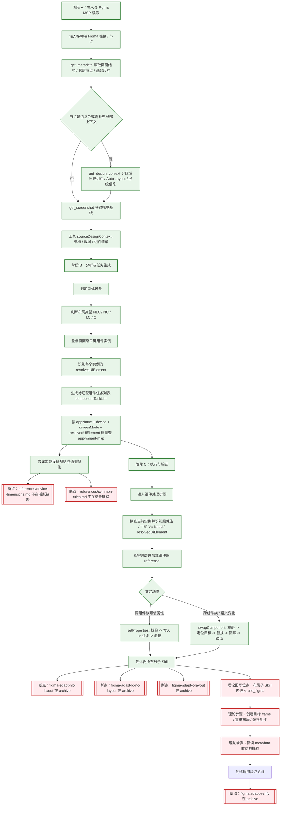

# Current Execution Map

本文档用于说明当前 Skill 仓库在“输入一个移动端 Figma 链接后”实际能跑通的链路，以及会在哪些环节中断。

它不是目标架构图，而是当前仓库状态图。

## 当前可执行链路 / 断点链路

## 结论

- `skill-main-workflow` 应该是默认且唯一的生产主入口。
- 当前图中只保留一条生产主链路；原先独立的组件测试 Case 流程已移除。
- `figma-component-dictionary` 不再作为并列入口出现，而是收敛为主链路内部复用的组件处理能力。
- `app-variant-map` 是数据映射层，不是流程入口；它在主链路中按 `componentTaskList` 被批量查询。
- 组件处理步骤已经具备明确的 Figma 回写阶段，发生在主链路内部的组件处理节点中。
- 整页多端适配链路理论上也有 Figma 回写阶段，但应发生在布局子 Skill 内；当前在到达该阶段前已中断。
- 组件处理能力的关键依赖是：
  - `figma-component-dictionary.md`
  - `references/app-variant-map-{appName}.md`
  - `references/component-dictionary/{component-family}.md`
- 整页多端适配主链路目前停在“组件任务生成后无法继续委托执行”的状态，因为布局规则、布局子 Skill 和验证 Skill 仍主要停留在 `archive/`。

## 关键字段归属

| 字段 | 归属文件 | 当前状态 |
| --- | --- | --- |
| `figmaUrl` | `skill-main-workflow.md` | 活跃 |
| `nodeId` | `skill-main-workflow.md`、`figma-component-dictionary.md` | 活跃 |
| `sourceDesignContext` | `skill-main-workflow.md` | 理论上应显式承接 `get_metadata` / `get_design_context` / `get_screenshot` 的汇总结果，当前未落成稳定字段 |
| `resolvedUiElement` | `figma-component-dictionary.md` | 活跃 |
| `resultType` | `references/app-variant-map-文管.md` | 活跃 |
| `targetVariantId` | `references/app-variant-map-文管.md`、`figma-component-dictionary.md` | 活跃 |
| `actionType` | `figma-component-dictionary.md` | 活跃 |
| `targetDevice` | `skill-main-workflow.md` | 活跃 |
| `layoutType` | `skill-main-workflow.md` | 活跃 |
| `componentTaskList` | 理论上应归属 `skill-main-workflow.md` 或布局子 Skill 入口 | 当前活跃链路缺少显式承载 |
| `targetFrameId` | 理论上应归属布局子 Skill / 验证 Skill | 当前活跃链路缺失 |
| `writeResult` | `figma-component-dictionary.md` | 活跃 |
| `layoutWriteResult` | 理论上应归属布局子 Skill | 当前活跃链路缺失 |
| `validationResult` | 组件处理步骤归属 `figma-component-dictionary.md`；整页链路理论上归属验证 Skill | 组件处理步骤活跃；整页链路缺失 |

### 按文件归拢

#### `skill-main-workflow.md`

- `figmaUrl`
- `nodeId`
- `sourceDesignContext`（理论上应在 Figma MCP 读取阶段显式产出，但当前未落成活跃字段）
- `targetDevice`
- `layoutType`
- `componentTaskList`（理论上应在整页链路中显式产出，但当前未落成活跃字段）

#### `figma-component-dictionary.md`

- `nodeId`（组件上下文）
- `resolvedUiElement`
- `targetVariantId`
- `actionType`
- `writeResult`
- `validationResult`

#### `references/app-variant-map-文管.md`

- `resultType`
- `targetVariantId`

#### 当前没有活跃归属、但理论上必须存在的整页链路字段

- `componentTaskList`
- `targetFrameId`
- `layoutWriteResult`
- 整页链路的 `validationResult`

它们本应归属：

- 布局子 Skill：`figma-adapt-nlc-layout` / `figma-adapt-lc-nc-layout` / `figma-adapt-c-layout`
- 验证 Skill：`figma-adapt-verify`

## use_figma 回写拆解

### 主链路内组件处理步骤：`setProperties`

当前可执行的最细粒度回写步骤是：

1. 写前校验当前实例的 `mainComponent`
2. 校验目标属性键和值是否在真实值域中
3. 在 `use_figma` 中执行 `instance.setProperties(...)`
4. 回读 metadata，确认 `variantProperties` 已生效
5. 再做截图和结构验证

### 主链路内组件处理步骤：`swapComponent`

当前可执行的最细粒度回写步骤是：

1. 写前校验当前实例是否允许替换
2. 校验目标组件族和替换边界
3. 通过 `componentSetKey` / `search_design_system` / anchor 定位目标组件
4. 必要时 `importComponentSetByKeyAsync(...)`
5. 在 `use_figma` 中执行 `swapComponent(...)`
6. 回读 metadata，确认新的 `mainComponent` 和挂载关系正确
7. 再做截图和结构验证

### 整页链路：理论上的回写步骤

如果后续把布局子 Skill 拉回活跃链路，整页适配中的 `use_figma` 回写应至少拆成：

1. 用 `get_metadata` 读取源页面结构
2. 必要时用 `get_design_context` 补足局部组件与布局上下文
3. 用 `get_screenshot` 固化视觉基线
4. 盘点页面中的关键组件实例
5. 识别每个实例的 `resolvedUiElement`
6. 生成 `componentTaskList`
7. 按目标设备和屏幕模式批量查 `app-variant-map`
8. 创建或复制目标 frame
9. 重排 Auto Layout / 栏宽 / 间距
10. 按任务列表替换导航框架和高频组件
11. 回读 metadata 做结构校验
12. 交给验证 Skill 做视觉与规则校验

## 当前可执行范围

理论上的生产主链路是整页多端适配，但当前只在“页面级组件任务生成”和“主链路内组件处理步骤”之前及之内具备较清晰结构，后续布局执行与验证仍未回到活跃链路。

当前满足以下条件时，主链路内的组件处理步骤可以工作：

- 已有可探查的 Figma 当前实例或目标节点上下文
- 可以从实例探查中识别出 `resolvedUiElement`
- 目标应用存在对应的 `app-variant-map`
- 目标组件族存在对应的 component reference

## 当前主要断点

### 1. 整页布局规则未处于活跃链路

当前生产主链路仍引用以下内容，但它们没有处于当前活跃主链路：

- `references/device-dimensions.md`
- `references/common-rules.md`
- `figma-adapt-nlc-layout`
- `figma-adapt-lc-nc-layout`
- `figma-adapt-c-layout`
- `figma-adapt-verify`

此外，整页链路虽然理论上需要先产出页面级 `componentTaskList`，但当前活跃仓库里还没有一份文档把这一步显式定义成稳定中间产物。

### 2. 应用映射表覆盖面不足

当前活跃的应用 variant 映射表只有：

- `references/app-variant-map-文管.md`

### 3. 组件族 reference 覆盖面不足

当前活跃的组件族 reference 主要是：

- `references/component-dictionary/navigation-bar.md`
