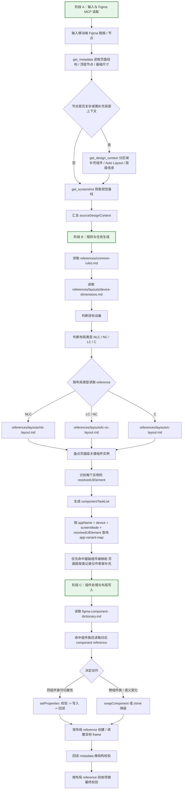

# Current Execution Map

本文档用于说明当前 Skill 仓库在“输入一个移动端 Figma 链接后”的实际执行链路、活跃 reference 和仍存在的缺口。

当前仓库采用 **一个主 Skill + 多个按需读取 reference** 的结构：

- 唯一入口：`skill-main-workflow.md`
- 布局 reference：`references/layouts/*.md`
- 通用规则：`references/common-rules.md`
- 设备尺寸：`references/layouts/device-dimensions.md`
- 组件处理协议：`figma-component-dictionary.md`
- 应用映射表：`references/app-variant-map-{appName}.md`
- 应用映射表模板：`references/app-variant-map-template.md`
- 组件族事实源：`references/component-dictionary/{component-family}.md`

## 当前可执行链路

## 结论

- `skill-main-workflow.md` 是默认且唯一的生产主入口。
- `figma-component-dictionary.md` 不再作为并列 Skill 入口出现，而是主链路内部按需读取的组件处理 reference。
- 布局执行不再拆成并列入口；主流程按布局类型读取 `references/layouts/*.md` 后执行。
- `app-variant-map` 是数据映射层，不是流程入口；它在主链路中按 `componentTaskList` 被批量查询。
- `app-variant-map` 当前已有统一模板 `references/app-variant-map-template.md`，后续新建或重构应用映射表应优先按该模板收敛。
- 应用映射表默认优先维护基础组件级条目；`页面框架` 类记录只作为骨架级补充，不应替代 `状态栏`、`标题栏`、`底部导航`、`侧边栏`、`搜索栏`、`标签栏`、`Fab` 等基础组件映射。
- 整页多端适配链路已经恢复布局 reference 依赖，但独立验证 reference 仍未活跃化；当前验证依赖各布局 reference 的“默认验收标准”。

## Reference 加载矩阵

| 场景 | 必须读取 |
| --- | --- |
| 所有适配 | `references/common-rules.md`, `references/layouts/device-dimensions.md` |
| LC / NC | `references/layouts/lc-nc-layout.md` |
| NLC | `references/layouts/nlc-layout.md` |
| C | `references/layouts/c-layout.md` |
| 折叠屏历史规则补充 | `references/layouts/foldable-layout.md` |
| 组件切换 | `figma-component-dictionary.md`, 对应 `references/component-dictionary/{component-family}.md` |
| 应用映射 | `references/app-variant-map-{appName}.md` |
| 验证 | 对应布局 reference 的验收标准；独立验证 reference 待活跃化 |

硬约束：

- 未读取对应布局 reference 前，不允许执行 Figma 写入。
- 布局 reference 中的栏宽、栏位职责和验收项优先级高于模型推断。
- 例如 Fold LC 下，NavigationBar 必须位于 L 栏内，不能作为全宽标题栏跨越 C 栏。

## 关键字段归属

| 字段 | 归属文件 | 当前状态 |
| --- | --- | --- |
| `figmaUrl` | `skill-main-workflow.md` | 活跃 |
| `nodeId` | `skill-main-workflow.md`、`figma-component-dictionary.md` | 活跃 |
| `sourceDesignContext` | `skill-main-workflow.md` | 活跃产物，应汇总 metadata / designContext / screenshot |
| `targetDevice` | `skill-main-workflow.md` + `references/layouts/device-dimensions.md` | 活跃 |
| `layoutType` | `skill-main-workflow.md` | 活跃 |
| `layoutReference` | `references/layouts/*.md` | 活跃 |
| `componentTaskList` | `skill-main-workflow.md` | 应显式产出 |
| `resolvedUiElement` | `figma-component-dictionary.md` | 活跃 |
| `resultType` | `references/app-variant-map-{appName}.md` | 活跃 |
| `targetVariantId` | `references/app-variant-map-{appName}.md`、`figma-component-dictionary.md` | 活跃 |
| `actionType` | `figma-component-dictionary.md` | 活跃 |
| `targetFrameId` | `skill-main-workflow.md` 执行阶段 | 应显式返回 |
| `writeResult` | `figma-component-dictionary.md` / 布局执行阶段 | 活跃 |
| `validationResult` | 布局 reference 验收项 / 组件处理验证 | 活跃但需继续结构化 |

## 当前主要缺口

### 1. 独立验证 reference 尚未活跃化

旧版 `figma-adapt-verify.md` 仍在 `archive/`。当前主链路应先按布局 reference 中的验收标准验证，但后续建议补一份活跃的 `references/verification/adapt-verify.md`，用于沉淀跨布局通用验收项。

### 2. 应用映射表覆盖面不足

当前活跃的应用 variant 映射表已经覆盖多款应用，但 README 和执行图类文档仍有滞后，需避免继续按早期“三份映射表”口径维护。

当前已存在的活跃映射表包括：

- `references/app-variant-map-文管.md`
- `references/app-variant-map-笔记.md`
- `references/app-variant-map-录音.md`
- `references/app-variant-map-设置.md`
- `references/app-variant-map-日历.md`
- `references/app-variant-map-天气.md`
- `references/app-variant-map-相册.md`
- `references/app-variant-map-短信.md`
- `references/app-variant-map-联系人.md`
- `references/app-variant-map-电话.md`
- `references/app-variant-map-计算器.md`
- `references/app-variant-map-收藏.md`
- `references/app-variant-map-扫一扫.md`
- `references/app-variant-map-下载管理.md`
- `references/app-variant-map-小米换机.md`

### 3. 组件族 reference 覆盖面不足

当前活跃的组件族 reference 主要是：

- `references/component-dictionary/navigation-bar.md`

## use_figma 回写拆解

### 主链路内组件处理步骤：`setProperties`

1. 写前校验当前实例的 `mainComponent`
2. 校验目标属性键和值是否在真实值域中
3. 在 `use_figma` 中执行 `instance.setProperties(...)`
4. 回读 metadata，确认 `variantProperties` 已生效
5. 再做截图和结构验证

### 主链路内组件处理步骤：`swapComponent` / clone 降级

1. 写前校验当前实例是否允许替换
2. 校验目标组件族和替换边界
3. 通过 `componentSetKey` / `search_design_system` / anchor 定位目标组件
4. 必要时 `importComponentSetByKeyAsync(...)`
5. 执行 `swapComponent(...)`，或在字体/组件限制下走 clone 降级
6. 回读 metadata，确认新的 `mainComponent` 和挂载关系正确
7. 再做截图和结构验证

### 整页链路回写步骤

1. 用 `get_metadata` 读取源页面结构
2. 必要时用 `get_design_context` 补足局部组件与布局上下文
3. 用 `get_screenshot` 固化视觉基线
4. 读取通用规则、设备尺寸和对应布局 reference
5. 盘点页面中的关键组件实例
6. 识别每个实例的 `resolvedUiElement`
7. 生成 `componentTaskList`
8. 按目标设备和屏幕模式批量查 `app-variant-map`
9. 创建或复制目标 frame
10. 按布局 reference 重排栏宽、间距和组件所在栏位
11. 回读 metadata 做结构校验
12. 按布局 reference 验收项做最终校验
